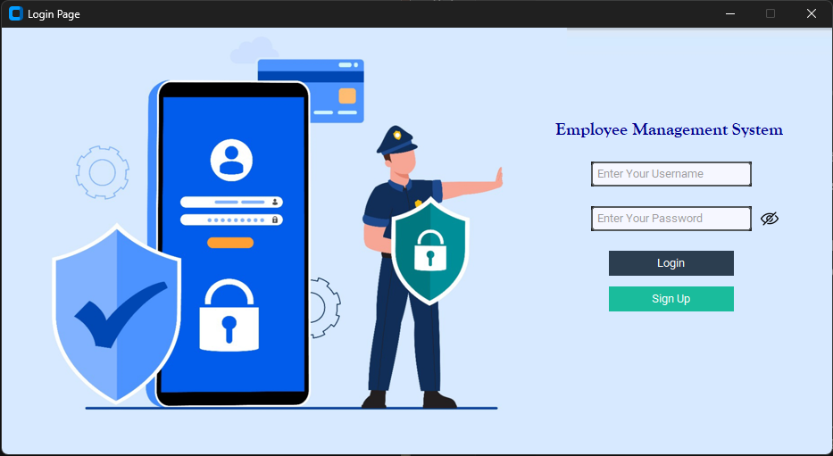
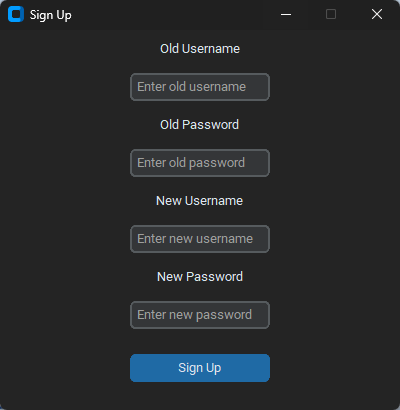
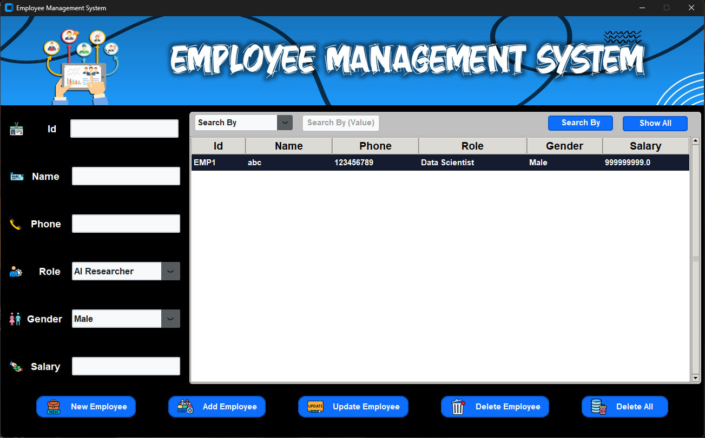

# Employee Management System

A robust, modern, and extensible **desktop application** for efficient employee data management, built with Python, CustomTkinter, and SQLite.

---

## 🚀 Features

- **Beautiful Modern UI:** CustomTkinter-based, clean design, dark/light-friendly.
- **User Authentication:** Secure login and password management with signup option.
- **Add, Update, Delete & Search:** Complete employee record CRUD functionality.
- **Case-Insensitive Search:** Enables quick, user-friendly lookups (e.g., `'Data Scientist'` or `'data scientist'`).
- **Image & Sound Assets:** Interactive UI with icons and button click sounds for feedback.
- **Data Persistence:** Uses SQLite database; all employee and user data stored safely.
- **Easy Packaging:** Hassle-free Windows EXE build with PyInstaller; everything bundled, no manual setup needed.
- **Modular Codebase:** Designed for future expansion — role-based access, analytics, cloud sync, and more.

---

## 🖥️ Screenshots

### Login Screen
 

### Additional Screenshots

| Signup Screen                                         | Dashboard Page                                  |
|-------------------------------------------------------|------------------------------------------------|
|  |  |

---

## 📦 Folder Structure

employee_management_system/
├── app/
│ ├── login.py
│ ├── main.py
│ └── database.py
├── assets/
│ ├── images/
│ │ └── ... (all UI images)
│ └── sounds/
│ └── click_button.wav
├── data/
│ └── (auto-created .db, user_data.txt)

---

## 🛠️ Installation & Run (For Developers)

1. **Clone the repository**  

git clone https://github.com/yourusername/employee_management_system.git
cd employee_management_system

2. **Install dependencies**  
pip install -r requirements.txt

3. **Run the application**  

python app/login.py

---

## 🏗️ Build Windows Executable (EXE)

After making code or asset changes:

1. Clean old builds:  

Remove-Item -Recurse -Force .\dist, .\build, .\EmployeeManagementSystem.spec

2. Build the EXE with PyInstaller:  

pyinstaller --name EmployeeManagementSystem --onefile --windowed --add-data "assets;assets" --add-data "data;data" app/login.py

3. Find your executable inside the `dist/` folder:

dist\EmployeeManagementSystem.exe

---

## 🌟 Contributing & Future Roadmap

This project is **modular and future-ready**! Some planned or potential enhancements:

- Advanced Role & User Access Management (multi-user roles)
- Analytics Dashboard with charts, trends, and CSV/Excel export
- Cloud data synchronization & multi-user remote access
- Theme switching (dark/light modes), localization, and internationalization

We warmly welcome **Pull Requests and ideas** to improve this project!

---

## 🤝 License

MIT License

---

*Built to scale and adapt. Ready for real-world HR teams and the next wave of desktop innovation!*

